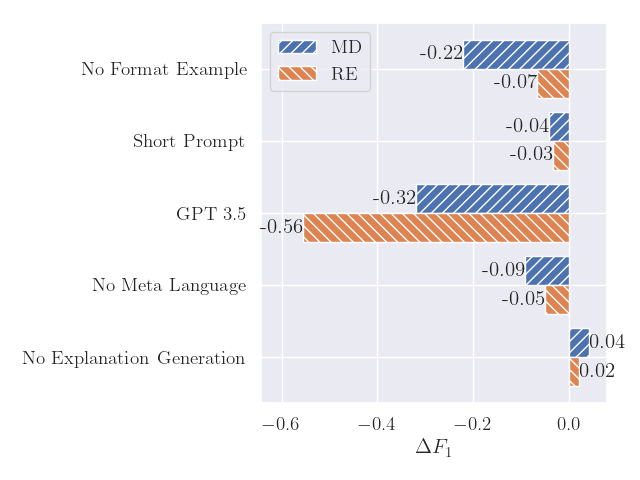

# Extracting Process Information from Natural Language Text Using Large Language Models

This is the code for our ER conference 2024 submission "A Universal Prompting Strategy for Extracting Process Model Information from Natural Language Text using Large Language Models", as well as material that did not make it into our paper.

Also check the companion repository for generating BPMN models from PET annotated documents: https://anonymous.4open.science/r/pet-to-bpmn-poc-B465/README.md


Performance for the MD task on PET by number of shots.

---




Left: Most relevant results of our ablation study. Right: Differences in performance for 10 repeated runs. 

---


Both: Performance when rephrasing prompts, change in wording measured as the cosine similarity of the prompt BOW representation. Minor changes in similarity elicit only minor changes in performance. 


## Installation

### Requirements

- Conda or Mamba installation: [https://github.com/conda-forge/miniforge](https://github.com/conda-forge/miniforge)
- OpenAI API key: [https://platform.openai.com/](https://platform.openai.com/)

### Setup

Create a new conda environment with all the required dependencies and activate it by running

```shell
mamba env create -f env.yaml
conda activate llm-process-generation
```

Download the required datasets from 

- Quishpi data (ATDP dataset): [https://github.com/PADS-UPC/atdp-extractor/tree/bpm2020](https://github.com/PADS-UPC/atdp-extractor/tree/bpm2020). Download and copy folder `input` into `res/data/quishpi`
- van der Aa data (DECON dataset): [https://github.com/hanvanderaa/declareextraction/tree/master/caise2019version](https://github.com/hanvanderaa/declareextraction/tree/master/caise2019version). Download `datacolection.csv` and copy file into `res/data/van-der-aa`

### Running experiments

You can find top level files for all experiments we ran:

- `pet_md.py`: Mention detection on pet data
- `pet_er.py`: Entity resolution on pet data
- `pet_re.py`: Relation extraction on pet data
- `vanderaa_md.py`: Mention detection on van der Aa data
- `vanderaa_re.py`: Constraint extraction on van der Aa data
- `quishpi_md.py`: Mention detection on Quishpi data
- `quishpi_re.py`: Constraint extraction on Quishpi data
- `analysis.py` contains the code for the ablation study

Note that running these files requires your OpenAI api key to be set as an environment variable!

### Prompts and Answers

You can find all the prompts that we used during our experiments (even archived and early ones) in `res/prompts/`.

Answers for the reported runs can be found in `res/answers`. You can parse these files using `experiments/parse.py`.
Set the path to the answer file near line 347: `answer_file = f"res/answers/analysis/re/no_disambiguation.json"`
and run the file using `python -m experiments.parse` from the top level project directory.